## DAT-202: Data Analytics 2 Final Project

### Background

I'm very interested in weather and climate, so for my final project I wanted to try my hand at building two forecasting models on weather events. Digging around online I discovered there were several great resources with the most appealing being the National Climatic Data Center (NCDC) created by the National Oceanic and Atmospheric Administration (NOAA). 

Originally I had wanted to focus on severe weather events in my area, such as, floods, snowstorms, severe thunderstorms, etc. to work on building a model. I realized however that these weather events are too sporadic for novice modeling and wouldn't necessarily lend themselves well to forecasting. With that I pivoted to rainfall, specifically observed rainfall in Pittsburgh. I found that the NCDC publishes an hourly percipitation dataset for my region terminating in 2014. I decided to query data for a period of ten years and use that instead of severe weather. 

### About the data

The [data set](https://www.ncdc.noaa.gov/cdo-web/datasets#PRECIP_HLY) was queried from the NCDC website for hourly observed rainfall in Pittsburgh from 2004 to 2014 (January, 1 2014 is the final date for which data is available). The fields available are the date time (as the data is recorded hourly), the ID of the station where the observation was made, the station name in plaintext, and HPCP which is a measurement for the amount of rainfall observed within the hour in 1/100th's of an inch. In order to create a train and test set, I partitioned years 2004 through 2012 into the training set and kept 2013 - EOY as the test set.
Additional information can be found in the [data dictionary.](https://www1.ncdc.noaa.gov/pub/data/cdo/documentation/PRECIP_HLY_documentation.pdf)
#### Raw plotted training data (2004 - 2012)
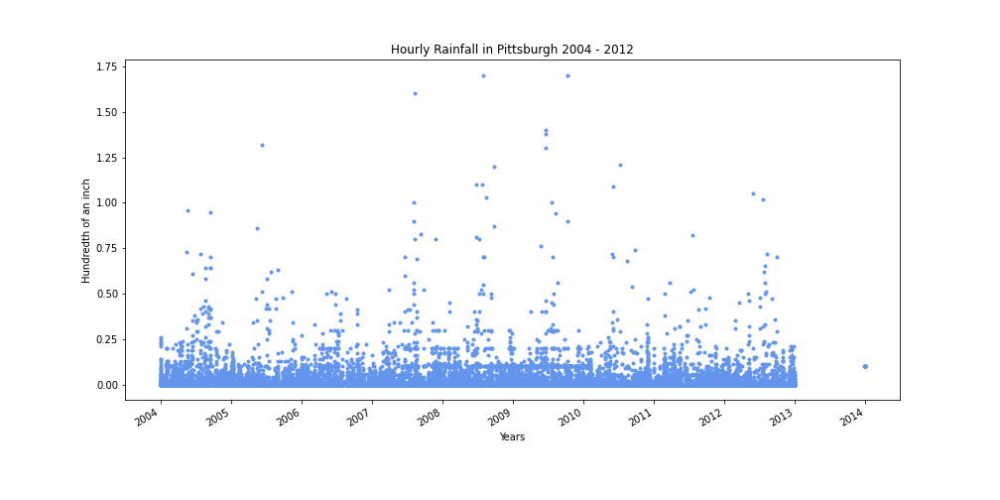
#### Data plotted as a bar chart for better visability of seasonality
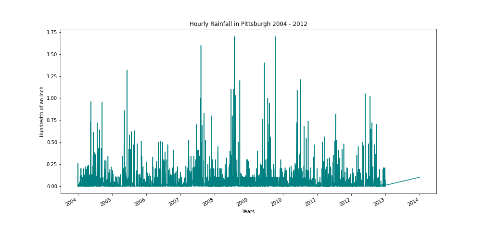


### Forecasting Models

Since the data is seasonal I wanted to use Prophet as the tool is able to handle seasonality out of the box with mininal data processing. While Prophet seemed like the obvious choice, I wanted to try working with and ARIMA model to try something a little more challenging. In the subsections below I'll discuss the models used, the work involved in building each indluding output graphs, and finally a brief conclusion on which model worked better for this data set.

#### Prophet

The Prophet model seemed to be the best fit for the data as it has the ability to handle seasonality. That being said weather is inheritely more unpredictable and more heavily impact by other factors than Prophet may be able to handle. 
The model started by importing all the libraries I would use in my code and loading the dataframe. Once the dataframe was initialized, I normalized the data by removed the data set's notation for NaN values. The final preperatory task was the subset the dataframe to only contain the Date and HPCP values with new column headers; "ds" and "y".
From there it was a simple as creating a model object by calling the Prophet function and fitting the model to the training data. The output of model returned a dataframe with predicted y-hat values. 
Here is a plot of the training data and the model's prediction:

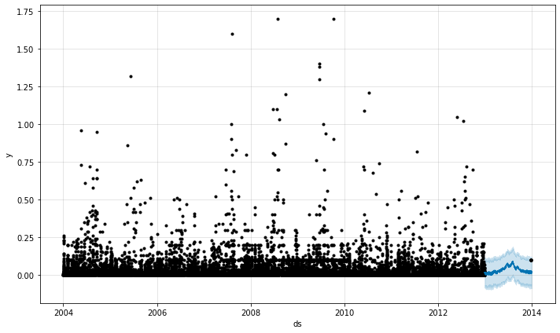

And here are the components of the model on the test set:

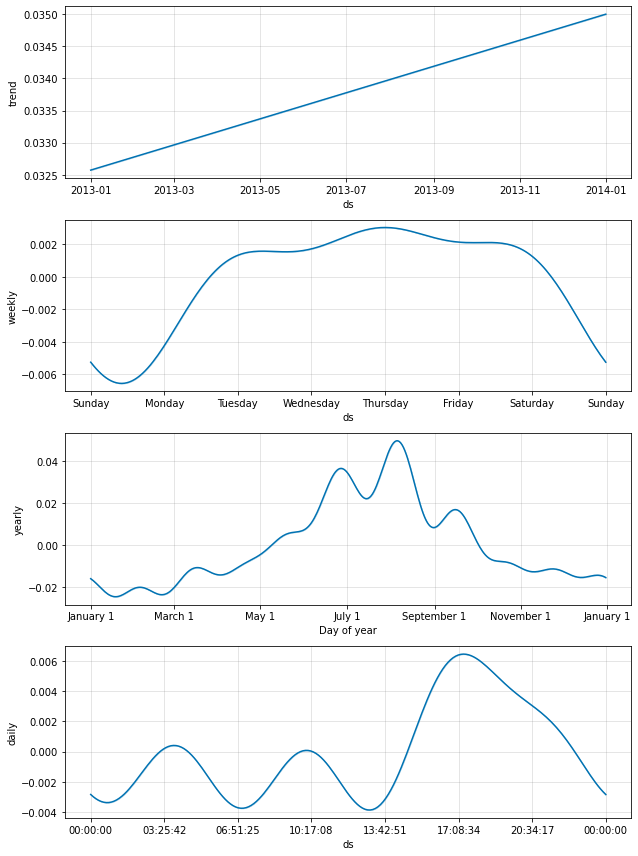

Finally I plotted the model's prediction with the full rainfall data set (left) as well as a snapshot of the real and predicted values for only the test set (right):

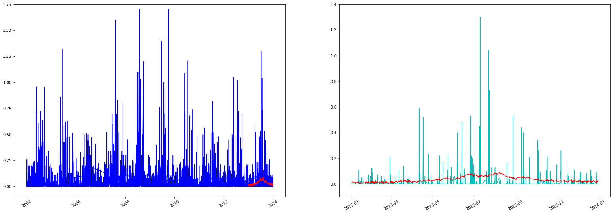

And for a closer look, I split the number of observations into four roughly equally sized parts and graphed them for better visibility:

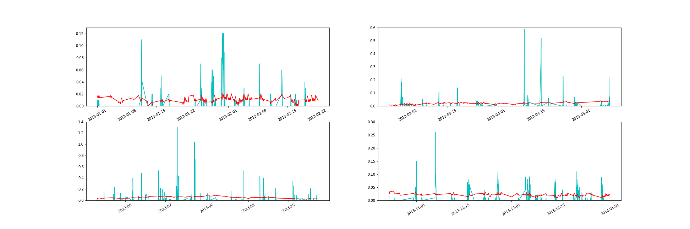

Finally, in order to evaluate the accuracy of my model I calculated the mean squared error and the mean absolute error:

**MSE** = 0.0037

**MAE** = 0.0294

These numbers quanitify the distance between the actual and predicted values. The mean squared error is the squared average distance between actual and predicted values whereas the mean absolute error is the absolute average distance.

These numbers are both really low! Which tells us that straight out the of the box without adding any fine tuning parameters we can get a very accurate prediction model for hourly rainfall. 

To see all of my Prophet model code, please [visit this link in my repo.](https://github.com/zachary-trozenski/dat202_ccac/blob/master/final_project/code/Final_Project_Prophet_code.ipynb)

#### ARIMA

The ARIMA model was a much more involved model than Prophet by what felt like a factor of 100. When I had originally started making this model, I performed the same pre-processing on the training data as I had with Prophet. However after I had built the model, fit my model to the training data, and tried to forecast the data, I wasn't getting anything close to the predictions I had expected. 

Falling down the rabbit hole of various online various, I discovered the reason for the poor predictions was that the ARIMA code could not infer any frequency information. The root cause was that since the dataset, as it was downloaded from the NCDC only recorded data when it was raining, meaning that all other days and times in my date range when it did not rain, were absent from my data set. ARIMA cannot handle these gaps.

In order to work around this limitation I processed my data before plugging it into the model. Essentially the end product was the sum of all rainfall on every day from 2004-01-01 through 2014-01-01. For more information on what that entailed, please see the [process log.](https://github.com/zachary-trozenski/dat202_ccac/blob/master/final_project/documentation/proc_log.md)

Now that I had the data pre-processed I pulled it into a Jupyter Notebook and graphed it to visualize the data:

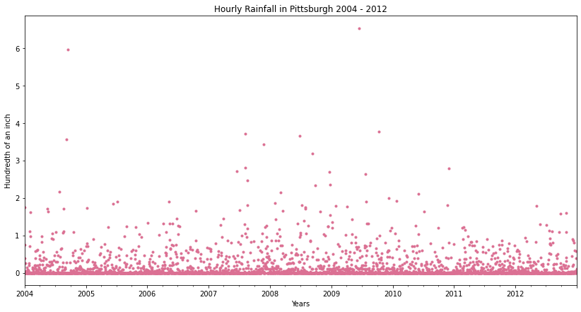

What was noticeable to me about this graph was the spikes in a given season were less pronounced. The data looked much more random than when I had plotted it for my Prophet model.

I then ran the `autocorrelation_plot()` function to determine if there autocorrelation over time, essentially visualizing changes in the data over time. The result indicated the following:

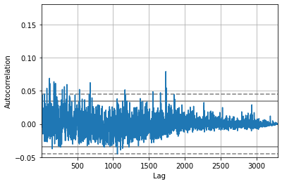

The solid and dotted lines within (0,0.05) and (0,-0.05) on the graph represent the 95th and 99th percentiles. Any values outside of these bands would be indicative of autocorrelation, since values close to zero indicate randomness. The rainfall data I graphed does have some values outside of this range but mostly clusters around zero suggesting that rainfall is (as presumed) mostly random, at least statistically.

With this knowledge ran the `ARIMA()` function indicating a daily frequency and an order of `(2, 0, 0)` before fitting the model. The reason I chose the order of (2, 0, 0) was random. I was just curious to see what would happen. 

Here is what the summary of the fit model returned:

```
                               SARIMAX Results                                
==============================================================================
Dep. Variable:                      y   No. Observations:                 3288
Model:                 ARIMA(2, 0, 0)   Log Likelihood               -1444.424
Date:                Tue, 01 Dec 2020   AIC                           2896.849
Time:                        18:08:50   BIC                           2921.241
Sample:                    01-01-2004   HQIC                          2905.582
                         - 12-31-2012                                         
Covariance Type:                  opg                                         
==============================================================================
                 coef    std err          z      P>|z|      [0.025      0.975]
------------------------------------------------------------------------------
const          0.1439      0.011     12.617      0.000       0.122       0.166
ar.L1          0.1032      0.014      7.475      0.000       0.076       0.130
ar.L2         -0.0092      0.019     -0.477      0.633      -0.047       0.029
sigma2         0.1410      0.001    145.087      0.000       0.139       0.143
===================================================================================
Ljung-Box (L1) (Q):                   0.00   Jarque-Bera (JB):            548891.92
Prob(Q):                              0.99   Prob(JB):                         0.00
Heteroskedasticity (H):               0.59   Skew:                             6.08
Prob(H) (two-sided):                  0.00   Kurtosis:                        65.12
===================================================================================

Warnings:
[1] Covariance matrix calculated using the outer product of gradients (complex-step).
```

The next step was then plot the residual errors of the model. The plot shows the errors on each observation.

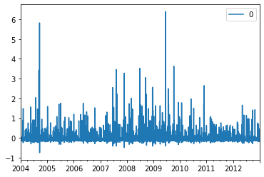 

We can also plot the distribution of the residual errors by density. The graph for this initial model looks like this:

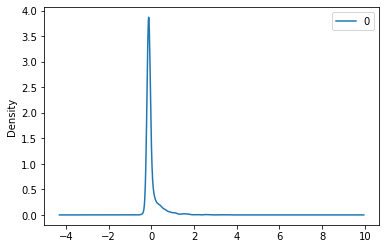

Finally, we have the descriptive statistics of the residual errors. Pay careful attention to the mean, as a non-zero mean indicates a bias in the model.

```
count  3288.000000
mean      0.000006
std       0.375504
min      -0.744198
25%      -0.130426
50%      -0.130056
75%      -0.041378
max       6.389258
```

Our model's mean is very close to zero, so we know there isn't any bias. So now, let's forecast the year 2013 and see how well it performs.

To do so, simply ran the `forecast()` fuction on the fit model and set the steps to 366 days. Then I loaded the test set data (please note, it was pre-processed the exact same way as the training set) and plotted the predicted and actual values. This was the output I received:

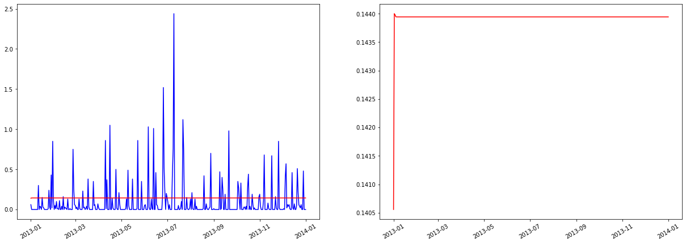

What's immediately striking about this is that the predicted value is completely flat. And to that end, it's unlike the predictions observed with the Prophet model.
However maybe the metrics can tell us something different. The mean squared and mean absolute errors for this model were:

**MSE** = 0.0618

**MAE** = 0.1688

These results are really not as bad as it seems. But I'm sure we could do better. I was curious about this output so I did some digging around online to see what other more experienced people had to say about flat predictions. 

What I dug up is that not *all* flat predictions are bad or incorrect. In this case what this means is that on any given day the model predicts that it will rain ~ 14 100ths of an inch (which as Pittsburghers shouldn't really surprise us since it always seems to rain :)). However I think that we can make improvements on our model and create a more dynamic prediction that uses seasonality as a parameter. 

In researching trying to improve the model, I came across several test that could help create a better model. The first was the augmented Dickey-Fuller test which tests the stationarity of a data set. The output of this test is a p-value which can indicate whether or not the data needs to be differenced to enforce stationarity. The results of the Dickey-Fuller test on the rainfall data returned a p-value of 0.0 meaning the null hypothesis can be rejected and consequently that our data has the necessary properties of stationarity.

Second, I imported the pmdarma library specifically to run the `auto_arima()` function. This function will conduct a series of tests to determine the optimal order for the model. In addition, this test can also take parameters for starting `p` and `q` values, as well as seasonality and `m` which represents a period. I should note that implementing a period of 366 failed as the memory limit was reached. Instead I opted to go with `7` as this represented a daily period (albeit apparently concentrated to one week).

The test took a little while to run but returned the following optimal order:

```
Best model:  ARIMA(1,0,1)(1,0,1)[7] intercept
Total fit time: 179.046 seconds
```

I ran through the same process as I had previously described building a new model with the new order and fitting it. This was the output of the fit model summary:

```
                                    SARIMAX Results                                    
=======================================================================================
Dep. Variable:                               y   No. Observations:                 3288
Model:             ARIMA(1, 0, 1)x(1, 0, 1, 7)   Log Likelihood               -1436.222
Date:                         Tue, 01 Dec 2020   AIC                           2884.445
Time:                                 18:09:34   BIC                           2921.033
Sample:                             01-01-2004   HQIC                          2897.544
                                  - 12-31-2012                                         
Covariance Type:                           opg                                         
==============================================================================
                 coef    std err          z      P>|z|      [0.025      0.975]
------------------------------------------------------------------------------
const          0.1433      0.018      8.055      0.000       0.108       0.178
ar.L1         -0.1880      0.164     -1.147      0.251      -0.509       0.133
ma.L1          0.2869      0.160      1.795      0.073      -0.026       0.600
ar.S.L7        0.9788      0.014     69.526      0.000       0.951       1.006
ma.S.L7       -0.9646      0.018    -53.125      0.000      -1.000      -0.929
sigma2         0.1402      0.001    127.012      0.000       0.138       0.142
===================================================================================
Ljung-Box (L1) (Q):                   0.01   Jarque-Bera (JB):            531398.60
Prob(Q):                              0.92   Prob(JB):                         0.00
Heteroskedasticity (H):               0.59   Skew:                             6.02
Prob(H) (two-sided):                  0.00   Kurtosis:                        64.11
===================================================================================

Warnings:
[1] Covariance matrix calculated using the outer product of gradients (complex-step).
```

I graphed the residuals and their density:

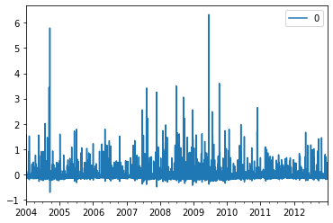

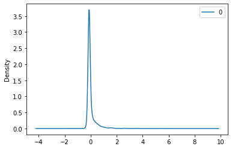

The graphs look very similar to those plotted with the first ARIMA model. Finally, the newly fit model has these descriptive statistics. Notice the change in the mean, again this model is not intensely biased as well.

```
count  3288.000000
mean     -0.000241
std       0.374568
min      -0.714249
25%      -0.140093
50%      -0.114516
75%      -0.043047
max       6.325110
```

Using the same method as previously, I forecast the next 366 days and compare it to the actual values. What I observed were predictions with a little more nuance, that seem to adhere to the general 'frequency' of the actual values (frequency in the sense of measuring waves).

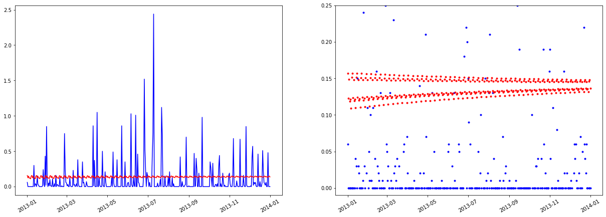

It's a little hard to see the data so zoomed in on the first (left) and last (right) 50 days of the forecast to get a better sense of what the data is doing.

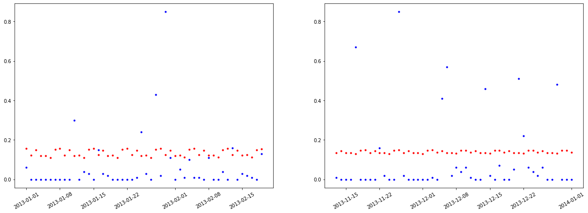

As I had mentioned before, the value `7` for the period seems more tied to weekly data, which is why I believe we're seeing the forecasted values fluctuate in a predictable pattern. Interesting it seems that the data flattens in the last 50 days, with predicted rainfall amounts bunching tighter and moving towards a flat line, possibly indicating that if we went further into the future all predictions would converge onto a single value.

It's a shame the memory runs out with an `m` value of 365, I would have liked to see how well the model performed could my machine handle it. There is likely a more suitable model or method for performing long term predictions but I am unaware of them to date. In the meantime we can take a looke at MSE and MAE to evaluate the change in modeling approached between model one and two.

**MSE** = 0.0608

**MAE** = 0.1637

We see a slight performance increase by 0.0010 and 0.0051 in MSE and MAE, respectively, indicating that accounting for seasonality and a period have a positive effect on the model's ability to predict rainfall. 

As a footnote, I built another model using the exact same methodology as the second ARIMA model except with ` m=52`. The outcome was, much like the first ARIMA model, a flat predicted rainfall amount and identical to the first ARIMA model. To me what this suggests is that we may have found the most optimal ARIMA configuration and that the performance of my second ARIMA model is the best this particular technique can do.


#### Conclusions

At the end of the day, if I had to choose a modeling technique again for rainfall data (or a different time series with additional characteristics) I would gravitate towards using Prophet. 

The resons being are that the tool works right out of the box with interrupted data, meaning there is minimal pre-processing required. Additionally the built in accomodation for seasonality was better suited to my data set. 

I will say, while the ARIMA model did not perform as well as the Prophet model, ARIMA is a powerful and immensely configurable tool that is suited to many time series data set. I throroughly enjoyed tinkering with the model and learning about what it is capable of doing. I also think it was a great learning oppurtunity to learn more about the data that goes into a model and how important it is to be very familiar with the data. It may have been a clunky process but getting my hands dirty was an invaluable learning oppurtunity. Prophet may be easier but its quality of being a "black box" that just works I think robs the user of knowledge.

Finally, what I thought was interesting is that no ARIMA model predicted 0 amounts of rain and Prophet seldom indicated 0 rainfall, though is is likely due to the input data for the Prophet model containing only observations of rainfall. The ARIMA dataset by contrast contained every day of the range. It's be a good future experiment to plug the pre-processed data set into Prophet and observe the outcome.

### References

* Prophet Jupyter Notebook by C. Sheldon-Hess (Blackboard)

* [Advanced Time Series Modeling (ARIMA) Models in Python](https://www.pluralsight.com/guides/advanced-time-series-modeling-(arima)-models-in-python)

* [Using Python and Auto ARIMA to Forecast Seasonal Time Series](https://medium.com/@josemarcialportilla/using-python-and-auto-arima-to-forecast-seasonal-time-series-90877adff03c)

* [Statsmodel Documentation](https://www.statsmodels.org)

* [Python | ARIMA Model for Time Series Forecasting](https://www.geeksforgeeks.org/python-arima-model-for-time-series-forecasting/)

* [How to use SARIMAX](https://www.kaggle.com/poiupoiu/how-to-use-sarimax)

* [Seasonal ARIMA with Python](https://www.seanabu.com/2016/03/22/time-series-seasonal-ARIMA-model-in-python/)

* [pmdarima Documentation](https://alkaline-ml.com/pmdarima/)

* [Why I get the same predict value in Arima model?](https://stats.stackexchange.com/questions/333092/why-i-get-the-same-predict-value-in-arima-model)

* [Machine Learning Mastery](https://machinelearningmastery.com/)

* [ARMA out-of-sample prediction with statsmodels](https://stackoverflow.com/questions/18616588/arma-out-of-sample-prediction-with-statsmodels)

* [Detecting Stationarity in time series data](https://towardsdatascience.com/detecting-stationarity-in-time-series-data-d29e0a21e638)

* [Stationarity and Differencing](https://otexts.com/fpp2/stationarity.html)

* [Prophet Documentation](https://facebook.github.io/prophet/docs/quick_start.html)

* [Python: “Pandas data cast to numpy dtype of object. Check input data with np.asarray(data).”](https://stackoverflow.com/questions/46534512/python-pandas-data-cast-to-numpy-dtype-of-object-check-input-data-with-np-asa)

* [Error: ValueWarning: A date index has been provided, but it has no associated frequency information and so will be ignored when e.g. forecasting](https://stackoverflow.com/questions/58510659/error-valuewarning-a-date-index-has-been-provided-but-it-has-no-associated-fr)

* [Where is the documentation on Pandas 'Freq' tags? [closed]](https://stackoverflow.com/questions/35339139/where-is-the-documentation-on-pandas-freq-tags)

* [Set pandas.tseries.index.DatetimeIndex.freq with inferred_freq](https://stackoverflow.com/questions/40222583/set-pandas-tseries-index-datetimeindex-freq-with-inferred-freq#40222783)
